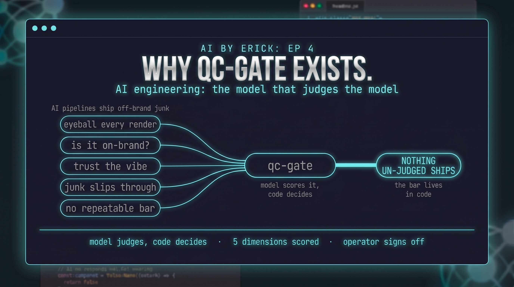

# qc-gate



An LLM-as-judge quality gate for AI-generated assets (images and music). A vision or
audio model scores each candidate against your reference set and a rubric, then the
PASS/FAIL is recomputed **in code** from the scores and critical violations: the model's
own verdict is advisory, the bar lives in code, not vibes. A human signs off last.

Built as the quality stage of a data-driven AI music pipeline (generate the asset, gate
it, post it, measure it), but it works for any generated visual or audio asset.

## Why

Generative pipelines drift off-brand and ship junk when nothing checks the output. This
gate makes the standard explicit and repeatable: you give it the reference set that
defines "on-brand," it admits nothing that does not clear the bar, and every rejection
comes with a reason you can learn from.

## How it works

Two gates:

1. **Auto-judge.** The model compares your reference set plus a candidate against
   `RUBRIC.md`, scoring five dimensions and returning a JSON verdict. `qc_gate.py`
   recomputes PASS/FAIL in code from those scores plus any critical violations, so the
   threshold is testable and version-controlled (`test_qc_gate.py`).
2. **Operator sign-off.** Anything the auto-judge passes is pending a human's approval.
   The human is the final gate, every time.

PASS routes to an approved folder, FAIL to a rejected folder with a JSON report.

## Use

```bash
export GEMINI_API_KEY=...        # read by name only, never embedded

# images: pass the reference set + a candidate
./qc-image.sh -c candidate.png -r ref1.jpg -r ref2.jpg

# music / batch: drop your references in references/, candidates in candidates/
./qc-music.sh path/to/candidate.png   # judge one
./qc-music.sh                         # judge everything in candidates/
```

You supply your own `references/` (the mood board that defines the standard) and
`candidates/` (raw output awaiting judgment). Neither is shipped with this repo.

## The rubric is the tuning surface

Recalibrate taste by editing `RUBRIC.md` (criteria plus thresholds), not the code. The
code enforces the bar; the rubric sets where it is.

## Tests

```bash
python3 test_qc_gate.py
```

## License

MIT.
